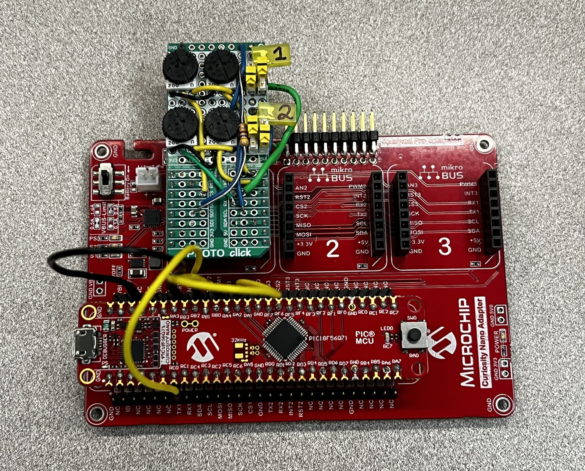
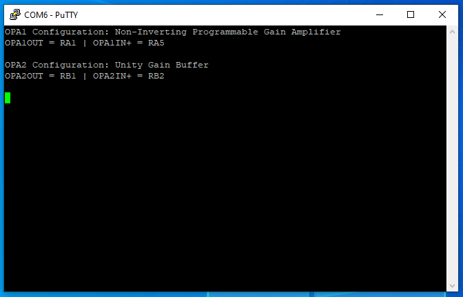

<!-- Please do not change this logo with link -->

# Demo for PIC18F56Q71 Dual Operational Amplifier (Op Amp)

This example shows the PIC18F56Q71 using two multi-configurable op amp modules. This project includes both op amp channels which is similar to the op amp demo on PIC18F16Q41.

## Related Documentation

- [PIC18F56Q71 Curiosity Nano User Guide](https://ww1.microchip.com/downloads/aemDocuments/documents/MCU08/ProductDocuments/UserGuides/PIC18F56Q71-CuriosityNano-HW-UG-DS50003481.pdf)
- [PIC18F56Q71 Curiosity Nano Device Page](https://www.microchip.com/wwwproducts/en/PIC18F56Q71)
- [PIC18F16Q41 Curiosity Nano Firmware Demo](https://github.com/microchip-pic-avr-examples/pic18f16q41-cnano-opamp-demo-fw)

## Software Used

  - [MPLAB® X IDE 6.10](http://www.microchip.com/mplab/mplab-x-ide) or newer
  - [MPLAB® XC8 2.41](http://www.microchip.com/mplab/compilers) or a newer compiler
  - [MPLAB® Code Configurator (MCC) 5.3.7](https://www.microchip.com/mplab/mplab-code-configurator) or newer
  - [Microchip PIC18F-Q Series Device Support (1.20.405)](https://packs.download.microchip.com/) or newer

## Hardware Used

- PIC18F56Q71 Curiosity Nano ([EV01G21A](https://www.microchip.com/en-us/development-tool/ev01g21a))
- Curiosity Nano Adapter board ([AC164162](https://www.microchip.com/en-us/development-tool/ac164162))
- Proto Click ([proto-click](https://www.mikroe.com/proto-click)) with modifications

## Setup
In this example, PIC18F56Q71 is used as a microcontroller.

 

The Curiosity Nano Adapter board enhances the capabilities of the PIC® MCU, and provides the user with easily adaptable mikroBUS™ headers.

 

A PROTO Click will be used to house the voltage potentiometers, status LEDs, logic switches, and a reset button.

 

## Schematic

 

## Physical Representation
|            Front                                   |                     Back                          |
|:--------------------------------------------------:|:-------------------------------------------------:|
| | |

This is the modified protoboard, which includes four potentiometers, four logic switches, two LEDs, and a reset button.

 

## Operation

The op amp configuration is determined based on the logic levels of Channel 1 pins (RC6, RC3), and Channel 2 pins (RC1, RC4). To select the OPA configuration, set the pins according to the table below. After setting the pins to match the desired OPA configuration, SW0 must then be pressed to update the OPA module configuration and resume operation. The PIC18F56Q71 operates in Sleep mode with the OPA enabled when not being reconfigured.

| RC6/RC3 | RC1/RC4 | Configuration                                       |  
|   ---   |   ---   | ----------------------------------------------------|
|    0    |    0    | 1 - Connected directly to external pins             |
|    0    |    1    | 2 - Unity Gain Buffer / Voltage Follower            |
|    1    |    0    | 3 - Non-Inverting Programmable Gain Amplifier (PGA) |
|    1    |    1    | 4 - Inverting Programmable Gain Amplifier  (PGA)    |

Please note that Weak Pull-ups are enabled on switch pins in this code example, so unless each pin is directly connected to ground they will read as logic '1' when setting up the OPA module configuration.

### Configuration 1: Connected Directly to External Pins

In this configuration, both of the OPA inputs and the output is connected directly to the corresponding I/O pins. This allows the OPA to be used on its own with external discrete components to provide a feedback network and achieve a specific functionality.

| OPAMP | OPA1IN+       | OPA1IN-       | OUTPUT        |
| ----- | -------       | --------------| ------------- |
| OPA1  | RA5 (OPA1IN2+)| RA2 (OPA1IN0-)| RA1 (OPA1OUT) |
| OPA2  | RB3 (OPA2IN2+)| RB2 (OPA2IN3-)| RB1 (OPA2OUT) |

 

### Configuration 2: Unity Gain Buffer

In this configuration, the OPA is configured as a unity gain buffer (voltage follower). When configured in this mode, only positive input of the OPA (OPAxIN+) and the output (OPAxOUT) are connected to the external I/O pins, while the negative input of the OPA (OPAxIN-) is internally connected to the output of the OPA as shown in the figure below to form a unity gain buffer.

| OPA   | Positive Input  | Output (OUT)  |
| :----:|:--------------: | :-----------: |
| OPA1  |  RA5 (OPA1IN2+) | RA1 (OPA1OUT) |
| OPA2  |  RB3 (OPA2IN2+) | RB1 (OPA2OUT) |

 

### Configuration 3: Non-Inverting PGA

In this configuration, the OPA is configured as a non-inverting programmable gain amplifier and uses the internal resistor ladder built into the OPA module. The positive input (OPAxIN+) and the output (OPAxOUT) of the OPA are connected to the corresponding I/O pins. The OPA is preconfigured with a gain of '4' using the internal resistor ladder. This gain can be changed by writing a different value to the GSEL bits of OPA1CON1 in the function named ``void OPA_NonInverting(void)`` located in ``application.c``.

| OPA    | Gain | Positive Input   | Output (OUT)  |
| :----: | :--: | :--------------: | :-----------: |
| OPA1   |  4   | RA5 (OPA1IN2+)   | RC2 (OPA1OUT) |
| OPA2   |  4   | RB3 (OPA2IN2+)   | RB1 (OPA2OUT)  |

 

 

### Configuration 4: Inverting PGA

In this configuration, the OPA is configured as an inverting programmable gain amplifier  and used the internal resistor ladder built into the OPA module. The OPA is preconfigured with a gain of '3' using the internal resistor ladder. This gain can be changed by writing a different value to the GSEL bits of OPAxCON1 in the function named ``void OPA_Inverting(void)`` located in ``application.c``.

| OPA    | Gain | Positive Input   | Output (OUT)  |
| :----: | :--: | :--------------: | :-----------: |
| OPA1   |  3   | RA2 (OPA1IN2-)   | RC2 (OPA1OUT) |
| OPA2   |  3   | RB2 (OPA2IN3-)   | RB1 (OPA2OUT)  |

 

 

## Demonstration

 

This shows channel 1 in configuration 3 (Non-Inverting Programmable Gain), and channel 2 in configuration 2 (Unity Gain Buffer). The user can determine which configuration the device is currently on, by watching the status LEDs blink or by checking the Terminal.

## Terminal Screen

 

This is the screen in your terminal on start/reset.

 

What you will see after SW0 is released, depending on your configurations.
